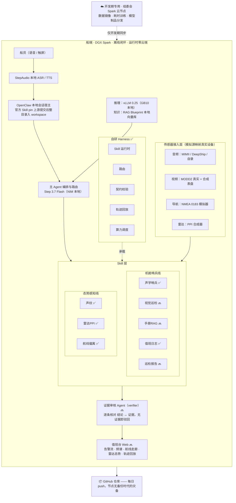

# 智舷 ShipMind —— 船舶离线值守多智能体副驾

> NVIDIA DGX Spark Hackathon · Agent Skills 开发挑战赛 参赛项目（队：Devx）
> 团队 2 人：二进制安全/AI 安全 × 机器学习 ｜ 方案定稿见 `docs/PROJECT-PLAN.md`

## 一句话

把一台 DGX Spark 搬上船：机舱里**听**异响、**看**仪表、**查**手册、**说**处置、**记**日志；驾驶台外**读**雷达、**辨**声纹、**守**航线——全部智能体运行在船端一台设备上，数据不出船。

## 痛点与场景

远洋货轮、油轮、LNG 船的机舱与驾驶台值班，长期依赖老师傅经验和手工文书：

- **机舱值班**：轮机员夜间独自值守，疲劳漏检；轴承磨损、泵阀气蚀靠耳朵听；设备手册是英日文大部头，报警来了翻不到。
- **驾驶台值班**：夜航雾航瞭望疲劳，漏看小目标；雷达光点靠人眼盯；COLREGs 避碰条款靠记忆。
- **文书负担**：轮机日志、航海日志手工填写，PSC 检查时翻半天。
- **通信现实**：卫星带宽按 MB 计费，机舱音视频持续上云推理在费用与带宽上都不可行；军警、渔业、极地航线长期无网。

## 为什么必须本地部署

1. **合规是硬约束**：《海上交通安全法》第二十四条规定，船舶在我国管辖海域通信须通过依法设置的境内海岸无线电台或卫星关口站转接。机舱音视频、AIS、航线数据在船内闭环处理，是合规风险最低的架构。
2. **带宽经济学**：卫星链路按流量计费且带宽有限，多路音视频持续上云推理不可行。
3. **时延与可靠性**：机舱告警要求秒级响应，卫星链路存在抖动与中断，安全相关系统不能依赖单一天线链路。
4. **数据主权**：航线、AIS、机舱运行数据是船东核心商业数据，即使链路可用也不应出境。

## 系统架构



完整架构图（含跨线融合数据流、数据资产流向、评测体系）见 [docs/architecture.md](docs/architecture.md)。

开发期使用组委会分配的 DGX Spark 云节点（连接信息见组委会私密登录表，不入仓库）；**运行时零云端依赖，演示全程不触网**。
## Skill 清单

### 官方 Skill（保持原样，pin 上游提交，保留 skill-card 与签名）

`rag-blueprint`（手册/COLREGs 本地知识库，v2.6.0）· `tao-generate-image-grounding`（仪表与部件开放词汇定位）· `tao-generate-referring-expressions`（为检测框生成语言指认，与 grounding 组成串联链）· `vss-generate-video-report` / `vss-ask-video`（巡检报告与视频问答）· `deepstream-generate-pipeline`（视频分析管线）。环境差异放外部适配层 `workspace/tools/run-official-skill.sh`，不改官方 Skill 本体，保证签名与评测有效。

### 自研 Skill

| Skill | 用途 | 状态 |
|---|---|---|
| `engine-room-acoustic-sentinel` | 机舱声学异常：特征提取、基线 z-score 对比、四级分级、成因提示（启发式轨；ML 轨为自编码器，见下） | ✅ 可运行 |
| `route-deviation-watch` | 航线走廊 XTE 越限分级 + CPA/TCPA（确定性，球面公式） | ✅ 可运行 |
| `radar-ppi-interpreter` | 合成 PPI 回波场 → 噪声底估计 → 连通域检测 → 目标方位/距离/置信度 | ✅ 可运行 |
| `sonar-acoustic-fingerprint` | 被动声纹（民用海事感知）：LOFAR 谱线 + DEMON 轴频 → 船类规则判别；ML 轨接 DeepShip 分类器 | ✅ 规则轨 |
| `navlog-autofill` | 事件流 → 标准轮机日志（确定性） | ✅ 可运行 |
| `trajectory-recorder` | Harness 内：执行轨迹录制/回放/diff | ✅ 可运行 |
| `engine-room-visual-inspector` | 仪表读数与设备状态（调 TAO + 微调小 VLM） | 🔜 D4 |
| `manual-rag-query` | 手册/COLREGs 检索，逐条带原文引用（调 rag-blueprint） | 🔜 D5 |
| `report-composer` | 多源证据巡检报告（调 vss-generate-video-report，经 verifier 复核） | 🔜 D6 |

手册语料为**自拟合成手册**（无版权风险，README 据实标注）。

## 模型与调优

- **机舱声学（双轨）**：启发式轨（信号特征 z-score，已实现）为可解释基线；ML 轨照 DCASE 2020 Task 2 官方配方重实现——log-mel 128×5=640 维 → 稠密自编码器（瓶颈 8 维）→ 重构误差评分，MIMII 泵/阀子集训练（CC BY-NC-SA，非商业可用），与启发式轨做 AUC 对照。
- **声纹分类**：DeepShip 4 类（**按船划分防泄漏**）+ ShipsEar（申请中）；LOFAR/DEMON 特征 + 轻量分类器，方法参考 DEMONet (arXiv:2411.02758)。
- **仪表与设备状态**：DGX Spark 上 TAO/NeMo 微调小 VLM。
- **编排大脑**：Step 3.7 Flash（198B 总参/11B 激活，Apache 2.0，NVIDIA NIM NVFP4 Day-0），256K 上下文容纳整本手册；语音链路 StepAudio-Skills。
- 详细引文与许可见 `docs/REFERENCES.md`。

## 评测方法

- **Skill 级**：每 Skill 一套 `evals/cases/<skill>.jsonl`，必含正向、负向、边界三类；带/不带 Skill 各跑一遍，差值即贡献。方法论对齐 NVIDIA Verified Skills 的 Tier3 Evaluated 关卡。负向用例（不该触发时必须不触发）与正向同等重要。
- **确定性模块零容差**：航线 XTE/CPA、日志生成用构造用例精确断言；ML 模块给置信度与 AUC。
- **双轨对照**（`evals/BENCHMARK.md`）：机舱声学异常检测同时实现启发式轨（信号特征 z-score，可解释）与 ML 轨（DCASE2020 官方配方自编码器）。**全量 test 集上启发式轨三机种全胜**（pump 0.687 / valve 0.777 / fan 0.630，AE 偏离度口径 0.602/0.490/0.529），且数据效率高一个量级（200 条建基线 vs 全量训练集）；同时发现 AE 带符号重构误差在 pump 上倒挂（小样本 0.260，偏离度口径 0.797），证实“异常=重构误差更高”的默认假设在真实数据上不总成立。小样本探索与全量回落过程均在文档中如实记录。
- **回归评测**：Step 3.7 Flash 在 API 与本地端点间切换必须过同一评测集。
- 统一运行器 `evals/run_evals.py`，当前 **13/13 通过**（声学分级/拒绝、航线三档+拒绝、雷达检出+零虚警、声纹判别+噪声不误判、日志生成+脏数据拒绝）。

## 技术栈说明

- **NVIDIA**：DGX Spark（GB10，ARM64）、DeepStream、TAO、VSS Blueprint、RAG Blueprint、vLLM 0.28、NVIDIA NIM（NVFP4）、skills CLI（npx skills@latest）、OpenClaw。
- **StepFun 阶跃星辰**：Step 3.7 Flash（编排大脑，多模态）、StepAudio-Skills（本地 ASR/TTS）。
- 模型切换只改 `base_url / model_name / api_key` 三值，切换后跑回归评测证明行为等价。

## 部署说明

1. DGX Spark（GB10）上 vLLM 0.28 提供本地推理端点；需设 `VLLM_USE_DEEP_GEMM=0` 与 `--moe-backend triton`（否则 DeepGEMM 报 `CUDA_ERROR_INVALID_IMAGE`）。
2. NIM 部署 Step 3.7 Flash；自研服务一律 `--host 0.0.0.0` 并加 token 鉴权（若经跳板映射暴露）。
3. 官方 Skill 经 skills CLI（≥ v1.5.16）安装；OpenClaw 作本地会话宿主，整目录复制进 workspace 后 `openclaw skills list --eligible` 验证。
4. 环境差异（本地端点、容器适配）在外部适配层处理，官方 Skill 本体不动。
5. 数据集不入仓库（`data/` 已 ignore），由 `evals/make_fixtures.py` 确定性生成评测夹具；真实数据集按 `docs/DATA-LICENSES.md` 台账管理。
6. 长训练任务进 tmux；重要产物以 git 远端为备份。

## 仓库结构

```
├─ README.md            本文件（项目说明/部署/技术栈）
├─ docs/                方案定稿、开发日志（十日谈）、参考库、数据许可台账、契约说明
├─ harness/             自研 Skill 运行时：注册表/路由/契约校验/执行轨迹/编排
├─ sensors/             传感器模拟层（NMEA 0183 模拟器）
├─ skills-src/          自研 Skill：SKILL.md + scripts/ + evals/ + contract.json
├─ evals/               统一评测运行器 + 确定性夹具生成（run_evals.py / make_fixtures.py）
├─ web/                 值班台界面（D6 交付）
└─ scripts/             冒烟测试（bash scripts/smoke.sh）
```

## 政策与事实依据（已核实）

| 事项 | 结论 | 来源 |
|---|---|---|
| 《智能船舶发展行动计划（2019—2021年）》 | 工业和信息化部、交通运输部、国防科工局联合印发（2018-12-31） | 中国政府网政策库、国防科工局 |
| CCS《智能船舶规范》2026 版 | 2026-06-01 生效；智能集成平台承担全船数据采集共享；新增 MASS CODE 检验服务自愿申请原则 | 中国船级社 |
| 《海上交通安全法》第二十四条 | 我国管辖海域通信须通过依法设置的境内海岸无线电台或卫星关口站转接 | 法律原文 |
| 卫星海事资费 | 星链海事套餐约 $1000/月·1TB ~ $5000/月·5TB，延迟 <99ms | 公开报道汇总 |

## 局限与后续

- 数据以公开数据集（MIMII/ToyADMOS/ShipsEar/DeepShip）与仿真源（NMEA/PPI 合成）为主，未上船实测；README 与演示中据实标注"合成数据"。
- 架构可平移至海上风电运维船、港口机械、海洋平台、内河船队等同样"离线 + 高可靠"场景。

## 仍未核实

DeepShip/ShipsEar 书面许可条款（申请流程进行中）；星链官网权威资费页；MIMII 各子集包体大小。跟进台账见 `docs/DATA-LICENSES.md`。
