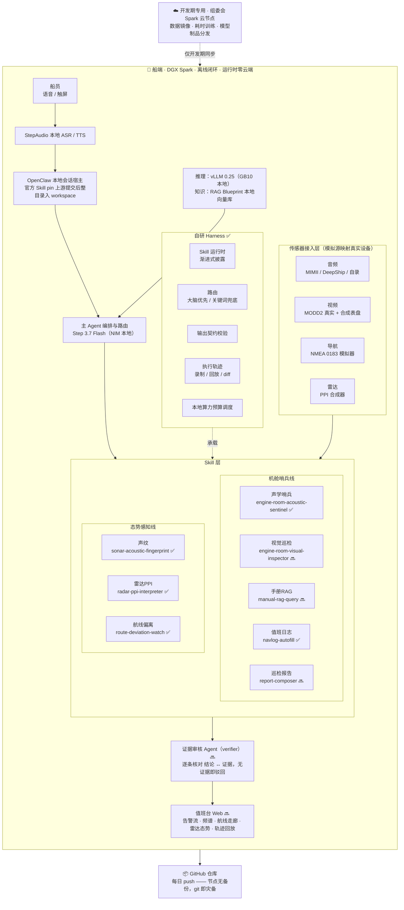
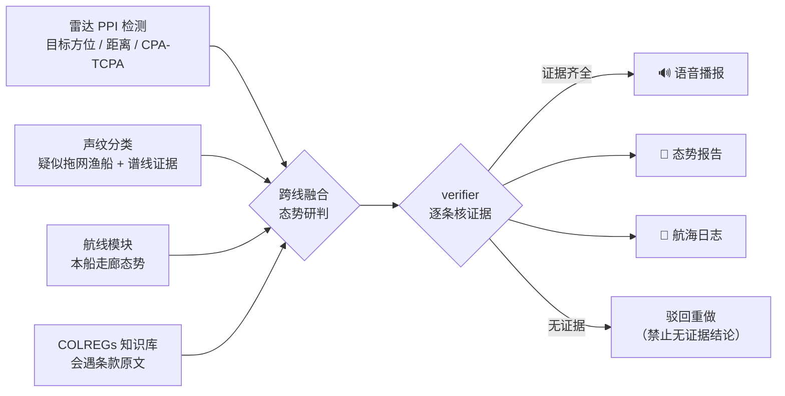
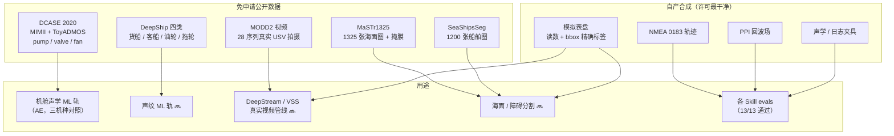
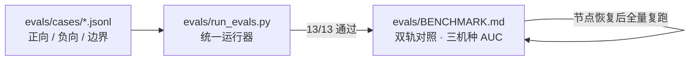

# ShipMind 架构图

> 图例：✅ 已实现可运行 ｜ 🔜 规划中（D4–D8）｜ 数据与代码均在本地/节点，运行路径零云端

## 1. 总体架构

## 2. 跨线融合数据流（演示主线的“多智能体协同”实证）

一条链路串起四个智能体与五类证据（雷达检测参数、声纹谱线、航线态势、规则原文、声学特征）——这是评审“多智能体协同”的直接证据。

## 3. 数据资产与流向

## 4. 评测体系（Tier3 式对照）

负向用例（不该触发时必须不触发）与正向同等重要；确定性模块（航线 XTE/CPA、日志）零容差，ML 模块给置信度与 AUC。
